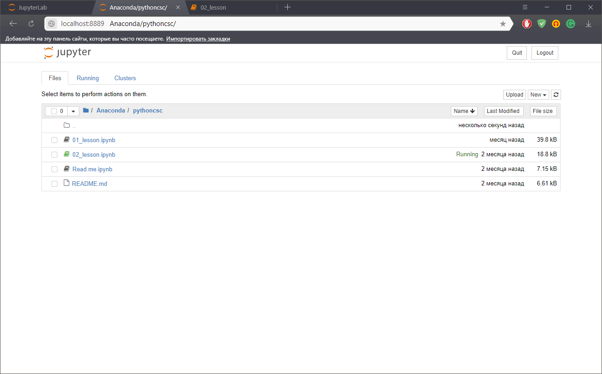

# Anaconda

**Anaconda** - это дистрибутив с установленным в него "большим" набором инструментов для работы с данными. Он основан да систему управления версий [Conda](https://conda.io/docs/). Скачать свежую версию, всегда можно скачать с [https://www.anaconda.com/download](https://www.anaconda.com/download/).

Что входив с состав данного дистрибутива?
    

## Jupyter Lab
**JupyterLab** – гибкой, интегрируемой и легко расширяемой среды, поддерживающей одновременную работу с несколькими блокнотами Jupyter, текстовыми файлами, датасетами, терминалами и другими компонентами. Аналогично классическим IDE в JupyterLab можно упорядочивать документы в рабочей области в удобном порядке при помощи вкладок и разделителей.
    

## Notebook
**Jupyter Notebook** – это крайне удобный инструмент для создания красивых аналитических отчетов, так как он позволяет хранить вместе код, изображения, комментарии, формулы и графики:
    
    

P.S. Есть очень интересная статья, которая посвещена этим двум инструментам: [https://proglib.io/p/jupyter/](https://proglib.io/p/jupyter/)

## Qt Console

## Spyder

## Glueviz

## Orange 3

## RStudio

## VS code